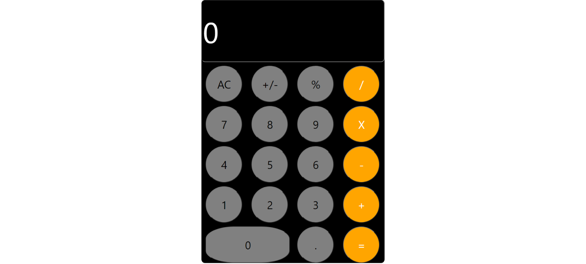

# Calculator

## Contents

* [Introduction](#Introduction)
* [Technologies](#Technologies)
* [Screenshot](#Screenshot)
* [Link](#Link)

## Introduction

The calculator project allow the user to perform calculations, ranging from basic arithmetic to complex mathematics.

## Technologies

Project is created with:

* Visual Studio Code 1.51.1
* Jquery 3.2.1
* Bootstrap 3.4.1
* React

## Screenshot

## Link

[Calculator](https://panwaramita.github.io/calculator/)
